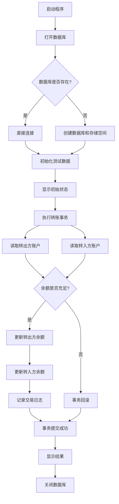
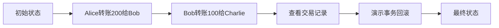

# IndexedDB 银行转账系统分析

## 文件概述

这是一个完整的 IndexedDB 银行转账系统演示案例，展示了如何使用 IndexedDB 进行复杂的事务处理、数据持久化和错误回滚。

## 核心功能流程图



## 详细流程说明

### 1. 数据库初始化流程

```
打开数据库 → 检查数据库版本 → 创建/升级存储空间
```

- **数据库打开**：使用 `indexedDB.open('BankDemoDB', 1)` 打开或创建数据库
- **存储空间创建**：
  - `users` 存储空间：存储用户信息（ID、姓名、余额、邮箱）
  - `transactions` 存储空间：存储交易记录（自动递增ID）

### 2. 转账事务核心流程

```
开始转账 → 读取转出方账户 → 读取转入方账户 → 验证余额 →
更新转出方余额 → 更新转入方余额 → 记录交易日志 → 提交事务
```

### 3. 错误处理流程

```
检测到错误 → 事务回滚 → 恢复原始状态 → 返回错误信息
```

## 关键组件说明

### 1. 数据库操作函数

- **`openDB()`** (indexDB.js:6-35): 打开或创建数据库，处理版本升级
- **`initTestData()`** (indexDB.js:38-65): 初始化测试用户数据
- **`transferMoney()`** (indexDB.js:68-162): 执行转账事务（核心功能）
- **`getAllUsers()`** (indexDB.js:165-181): 查询所有用户余额
- **`getTransactionHistory()`** (indexDB.js:184-205): 查询交易记录

### 2. 数据存储结构

- **`users` 对象存储**：
  - `keyPath: 'id'`：使用用户ID作为主键
  - 索引：`name` 和 `balance` 用于快速查询
  - 存储内容：用户基本信息和余额

- **`transactions` 对象存储**：
  - `keyPath: 'id'` + `autoIncrement: true`：自动生成交易ID
  - 存储内容：交易双方、金额、时间戳和状态

### 3. 事务特性

- **原子性**：要么全部成功，要么全部回滚
- **隔离性**：事务期间数据一致性
- **持久性**：成功提交后数据永久保存

## 演示流程



### 演示步骤详解

1. **初始状态**：
   - Alice: ¥1000
   - Bob: ¥500
   - Charlie: ¥200

2. **正常转账**：
   - Alice → Bob: ¥200
   - Bob → Charlie: ¥100

3. **事务回滚演示**：
   - 尝试 Charlie → Alice: ¥1000（余额不足）
   - 事务回滚，数据保持不变

4. **最终状态**：
   - Alice: ¥800
   - Bob: ¥600
   - Charlie: ¥300

## 技术特点

### 1. 异步处理
使用 Promise 和事件监听器处理异步数据库操作：
```javascript
request.onsuccess = () => resolve(request.result);
request.onerror = () => reject(request.error);
```

### 2. 事务管理
- 创建读写事务：`db.transaction(['users', 'transactions'], 'readwrite')`
- 事务回滚：`transaction.abort()`
- 事务完成：`transaction.oncomplete`

### 3. 数据验证
- 用户存在性检查
- 余额充足性验证
- 错误处理和回滚机制

### 4. 数据持久化
- 所有操作通过事务提交到数据库
- 交易记录永久保存
- 支持查询历史交易

## 学习价值

这个系统完整展示了 IndexedDB 的核心特性，包括：
- 数据库管理和版本控制
- 事务处理和原子性保证
- 复杂数据操作和错误处理
- 数据持久化和查询

非常适合作为 IndexedDB 学习的实战案例，帮助理解浏览器端数据库的应用场景和最佳实践。

## 章节索引

1. [数据库初始化流程](#1-数据库初始化流程)
2. [转账事务核心流程](#2-转账事务核心流程)
3. [错误处理流程](#3-错误处理流程)
4. [关键组件说明](#4-关键组件说明)
5. [数据存储结构](#5-数据存储结构)
6. [事务特性](#6-事务特性)
7. [演示流程](#7-演示流程)

## 完整代码

```javascript
// === IndexDB 银行转账完整案例 ===
console.clear();
console.log('🏦 启动 IndexDB 银行转账系统...');

// 1. 打开或创建数据库
const openDB = () => {
  return new Promise((resolve, reject) => {
    const request = indexedDB.open('BankDemoDB', 1);

    request.onerror = () => reject(request.error);
    request.onsuccess = () => resolve(request.result);

    request.onupgradeneeded = (event) => {
      const db = event.target.result;
      console.log('📦 数据库升级，创建对象存储空间...');

      // 创建用户存储空间
      if (!db.objectStoreNames.contains('users')) {
        const userStore = db.createObjectStore('users', { keyPath: 'id' });
        userStore.createIndex('name', 'name', { unique: false });
        userStore.createIndex('balance', 'balance', { unique: false });
        console.log('✅ 创建 users 存储空间');
      }

      // 创建交易日志存储空间
      if (!db.objectStoreNames.contains('transactions')) {
        const txStore = db.createObjectStore('transactions', {
          keyPath: 'id',
          autoIncrement: true
        });
        console.log('✅ 创建 transactions 存储空间');
      }
    };
  });
};

// 2. 初始化测试数据
const initTestData = async (db) => {
  return new Promise((resolve, reject) => {
    const transaction = db.transaction(['users'], 'readwrite');
    const userStore = transaction.objectStore('users');

    // 清空现有数据
    userStore.clear();

    // 添加测试用户
    const users = [
      { id: 'alice', name: 'Alice', balance: 1000, email: 'alice@demo.com' },
      { id: 'bob', name: 'Bob', balance: 500, email: 'bob@demo.com' },
      { id: 'charlie', name: 'Charlie', balance: 200, email: 'charlie@demo.com' }
    ];

    users.forEach(user => {
      userStore.add(user);
    });

    transaction.oncomplete = () => {
      console.log('📊 测试数据初始化完成:');
      users.forEach(u => console.log(`   ${u.name}: ¥${u.balance}`));
      resolve();
    };

    transaction.onerror = () => reject(transaction.error);
  });
};

// 3. 执行转账事务
const transferMoney = async (db, fromUser, toUser, amount) => {
  return new Promise((resolve, reject) => {
    console.log(`\n💸 开始转账: ${fromUser} → ${toUser} ¥${amount}`);

    // 创建读写事务，涉及 users 和 transactions 两个存储空间
    const transaction = db.transaction(['users', 'transactions'], 'readwrite');
    const userStore = transaction.objectStore('users');
    const txStore = transaction.objectStore('transactions');

    let fromAccount, toAccount;

    try {
      // 步骤1: 读取转出方账户
      const getFromRequest = userStore.get(fromUser);
      getFromRequest.onsuccess = () => {
        fromAccount = getFromRequest.result;
        if (!fromAccount) {
          throw new Error(`用户 ${fromUser} 不存在`);
        }
        if (fromAccount.balance < amount) {
          throw new Error(`用户 ${fromUser} 余额不足 (¥${fromAccount.balance})`);
        }
        console.log(`   ✓ 读取转出方: ${fromAccount.name}, 余额: ¥${fromAccount.balance}`);
      };

      // 步骤2: 读取转入方账户
      const getToRequest = userStore.get(toUser);
      getToRequest.onsuccess = () => {
        toAccount = getToRequest.result;
        if (!toAccount) {
          throw new Error(`用户 ${toUser} 不存在`);
        }
        console.log(`   ✓ 读取转入方: ${toAccount.name}, 余额: ¥${toAccount.balance}`);
      };

      // 步骤3: 更新账户余额
      transaction.addEventListener('complete', () => {
        console.log(`   ✓ 账户余额更新完成`);
      });

      // 等待所有读取完成后执行更新
      setTimeout(() => {
        try {
          // 更新转出方余额
          fromAccount.balance -= amount;
          userStore.put(fromAccount);
          console.log(`   ✓ ${fromAccount.name} 扣款 ¥${amount}, 新余额: ¥${fromAccount.balance}`);

          // 更新转入方余额
          toAccount.balance += amount;
          userStore.put(toAccount);
          console.log(`   ✓ ${toAccount.name} 收款 ¥${amount}, 新余额: ¥${toAccount.balance}`);

          // 记录交易日志
          const transactionRecord = {
            fromUser: fromUser,
            toUser: toUser,
            amount: amount,
            timestamp: new Date().toISOString(),
            status: 'completed'
          };
          txStore.add(transactionRecord);
          console.log(`   ✓ 交易日志记录完成`);

        } catch (error) {
          console.error('❌ 事务执行过程中出错:', error);
          transaction.abort();
          reject(error);
        }
      }, 100); // 小延迟确保所有读取完成

      // 事务成功完成
      transaction.oncomplete = () => {
        console.log('✅ 转账事务提交成功！所有操作已永久保存');
        resolve({
          success: true,
          message: '转账成功',
          fromBalance: fromAccount.balance,
          toBalance: toAccount.balance
        });
      };

      // 事务失败回滚
      transaction.onerror = () => {
        console.error('❌ 转账事务失败，所有操作已回滚:', transaction.error);
        reject(new Error(`转账失败: ${transaction.error?.message || '未知错误'}`));
      };

    } catch (error) {
      console.error('❌ 业务逻辑错误:', error.message);
      transaction.abort();
      reject(error);
    }
  });
};

// 4. 查询所有用户
const getAllUsers = (db) => {
  return new Promise((resolve, reject) => {
    const transaction = db.transaction(['users'], 'readonly');
    const userStore = transaction.objectStore('users');
    const request = userStore.getAll();

    request.onsuccess = () => {
      console.log('\n📋 当前所有用户余额:');
      request.result.forEach(user => {
        console.log(`   ${user.name} (${user.id}): ¥${user.balance}`);
      });
      resolve(request.result);
    };

    request.onerror = () => reject(request.error);
  });
};

// 5. 查询交易记录
const getTransactionHistory = (db) => {
  return new Promise((resolve, reject) => {
    const transaction = db.transaction(['transactions'], 'readonly');
    const txStore = transaction.objectStore('transactions');
    const request = txStore.getAll();

    request.onsuccess = () => {
      console.log('\n📜 交易记录:');
      if (request.result.length === 0) {
        console.log('   暂无交易记录');
      } else {
        request.result.forEach(tx => {
          const date = new Date(tx.timestamp).toLocaleString();
          console.log(`   ${date} | ${tx.fromUser} → ${tx.toUser} ¥${tx.amount}`);
        });
      }
      resolve(request.result);
    };

    request.onerror = () => reject(request.error);
  });
};

// 6. 演示事务回滚（故意制造错误）
const demonstrateRollback = async (db) => {
  console.log('\n🔄 演示事务回滚（故意制造错误）...');

  try {
    // 尝试转账金额超过余额
    await transferMoney(db, 'charlie', 'alice', 1000); // Charlie只有200余额
  } catch (error) {
    console.log(`✅ 事务正确回滚: ${error.message}`);

    // 验证数据确实没有变化
    console.log('\n🔍 验证回滚结果 - 检查余额是否保持不变:');
    await getAllUsers(db);
  }
};

// 主执行函数
const main = async () => {
  try {
    // 打开数据库
    const db = await openDB();
    console.log('✅ 数据库连接成功\n');

    // 初始化测试数据
    await initTestData(db);

    // 显示初始状态
    await getAllUsers(db);

    // 演示正常转账
    await transferMoney(db, 'alice', 'bob', 200);
    await getAllUsers(db);

    // 再转一笔
    await transferMoney(db, 'bob', 'charlie', 100);
    await getAllUsers(db);

    // 查看交易记录
    await getTransactionHistory(db);

    // 演示事务回滚
    await demonstrateRollback(db);

    // 最终状态
    console.log('\n🎉 演示完成！最终状态:');
    await getAllUsers(db);
    await getTransactionHistory(db);

    // 关闭数据库连接
    db.close();
    console.log('\n🔐 数据库连接已关闭');

  } catch (error) {
    console.error('💥 程序执行失败:', error);
  }
};

// 启动演示
main();
```